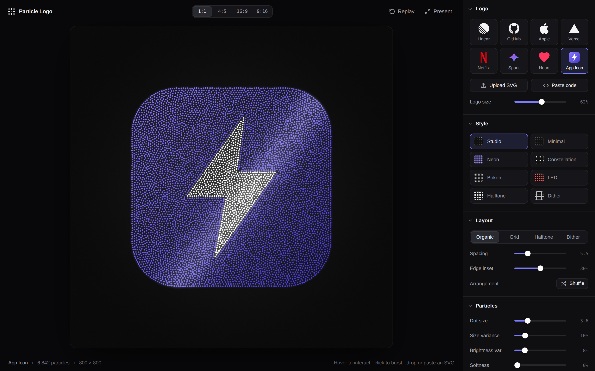

# Particle Logo

Turn any SVG logo into an interactive particle field — then export it as a
high‑resolution image, a vector SVG, a frame‑accurate video or a drop‑in HTML
embed. Inspired by [particl.art](https://particl.art) and
[Emil Kowalski's demo](https://x.com/emilkowalski/status/2036778116748542220).

**[Live Demo](https://particle-logo.vercel.app)** · **[Watch the 1‑minute walkthrough](docs/media/demo.mp4)**



## Highlights

- **Crisp, faithful shapes** — the SVG is rasterized at 2× supersampling,
  trimmed to its visible content and fit to the stage without distortion.
  Outlines are traced with marching squares and lined with evenly spaced
  particles (sharp corners are pinned), so edges stay clean at any density.
  Multi-color marks are split into color regions, and every hard internal
  color edge gets the same crisp treatment — while gradients stay smooth.
- **Styles** — eight curated looks (Studio, Minimal, Neon, Constellation,
  Bokeh, LED, Halftone, Dither) set every visual parameter in one click and
  leave your colors alone. Fine‑tune anything afterwards.
- **Four layouts**
  - **Organic** — contour particles plus a relaxed blue‑noise fill: calm,
    even and still clearly made of particles.
  - **Grid** — hexagonal or square dot matrix with coverage‑scaled edge dots.
  - **Halftone** — dot size follows tone, for gradients and multi‑color marks.
  - **Dither** — Floyd–Steinberg error diffusion on a centered lattice.

  Tone is measured in linear light. With the logo's own colors, dots keep
  their hue at full brightness and density carries the lightness, so the
  average color matches the source; in solid or gradient mode, density
  follows luminance.
- **Color** — keep the logo's own colors (gradients included), use a solid
  color, or apply an OKLab gradient at any angle. Low‑contrast uploads are
  detected and switched to a readable color automatically.
- **Motion** — five intros (Assemble, Vortex, Rise, Bloom, Dissolve), seamless
  morphing between logos, idle drift, twinkle and a periodic light sheen.
- **Interaction** — frame‑rate‑independent spring physics with repel, swirl,
  drag, a magnifying lens and click bursts.
- **Export**
  - **PNG** up to 8K, optionally transparent.
  - **SVG** — one `<circle>` per particle, grouped by color.
  - **Video** — MP4 (H.264) or transparent WebM (VP9 + alpha), rendered
    frame by frame at 60 fps via WebCodecs; optional seamless loop.
  - **HTML embed** — a single dependency‑free file (~100 KB) with the live,
    interactive logo. The intro plays when it scrolls into view and rendering
    pauses while it's off‑screen.
- **Aspect ratios** — 1:1, 4:5, 16:9 and 9:16 stages for social, slides and
  stories; **Present** mode (`F`) fills the screen.

## Getting started

```bash
npm install
npm run dev
```

Run the engine's unit tests (contours, layouts, color regions, color and
motion math) with `npm test`.

Drop an SVG anywhere on the page, paste SVG markup (⌘/Ctrl + V), or use
**Upload SVG**. Settings persist between visits.

| Shortcut | Action |
| --- | --- |
| `R` | Replay the intro |
| `F` | Toggle present mode |
| `Esc` | Leave present mode |

## Using the component

```jsx
import ParticleLogo from './ParticleLogo';
import { DEFAULT_CONFIG } from './engine/config';

const logoRef = useRef(null);

<ParticleLogo ref={logoRef} svg={svgMarkup} config={{ ...DEFAULT_CONFIG, intro: 'vortex' }} />;

// Later:
logoRef.current.replay();
const png = await logoRef.current.exportPNG({ longEdge: 4096, transparent: true });
const { blob } = await logoRef.current.exportVideo({ longEdge: 1920, hold: 3, loop: true });
const html = logoRef.current.exportHTML({ title: 'Acme' });
```

The canvas fills its parent while keeping the stage's aspect ratio. See
[`src/engine/config.js`](src/engine/config.js) for every option.

## How it works

1. **Rasterize** (`engine/rasterize.js`) — normalize the SVG (namespaces,
   viewBox), find its visible bounds, and draw it into a coverage + color
   field. Opaque, uniform backdrops are keyed out with edge color
   decontamination.
2. **Layout** (`engine/layouts.js`, `engine/contours.js`,
   `engine/regions.js`) — split multi-color logos into regions (k‑means,
   then merge clusters whose shared boundary is a smooth gradient), trace
   each region's iso‑contours, resample them evenly with corners pinned and
   inset them, then grow a Poisson‑disk fill, relax it with short‑range
   repulsion and plug any remaining voids. Lattice layouts use summed‑area
   tables for exact coverage.
3. **Render** (`engine/ParticleEngine.js`, `engine/shaders.js`) — three.js
   `Points` with analytic anti‑aliasing and premultiplied alpha. Intros,
   morphs, idle motion, sheen and lens are evaluated on the GPU; only pointer
   spring offsets are simulated on the CPU (`engine/motion.js`).
4. **Export** (`engine/exporters.js`) — offscreen renders at a fixed timestep;
   video is encoded with [mediabunny](https://mediabunny.dev); the HTML embed
   inlines a small WebGL runtime (`engine/embedRuntime.js`) that reuses the
   same shaders and motion code.

## Tips for great results

- Filled shapes work best; strokes are fine as long as they're not hairlines.
- Increase **Spacing** for a bolder, more graphic look; decrease it (and the
  dot size) for fine detail and larger exports.
- For presentations, a 16:9 stage with **Spotlight**, a subtle **Sheen** and
  the **Assemble** or **Vortex** intro reads beautifully on a projector.
- Video export needs WebCodecs (recent Chrome, Edge or Safari). Browsers
  without H.264 fall back to VP9, and the app tells you which codec was used.
