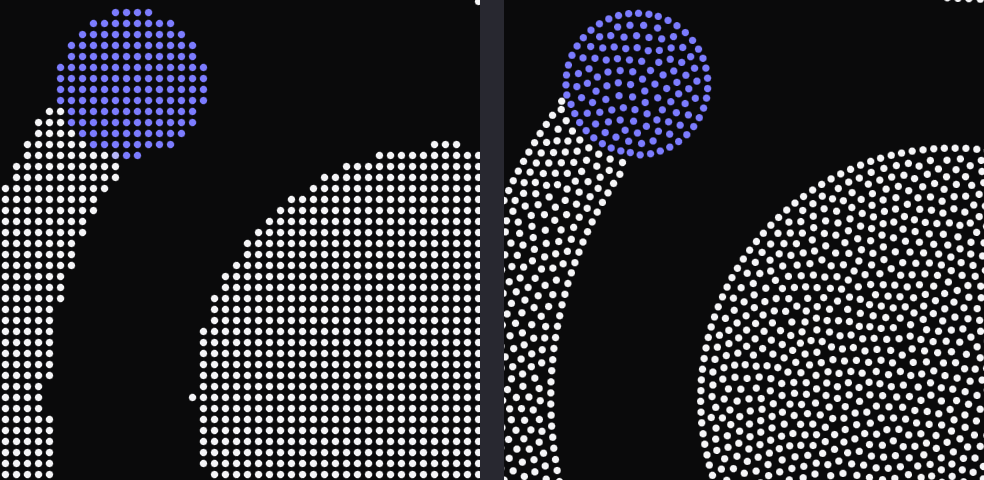
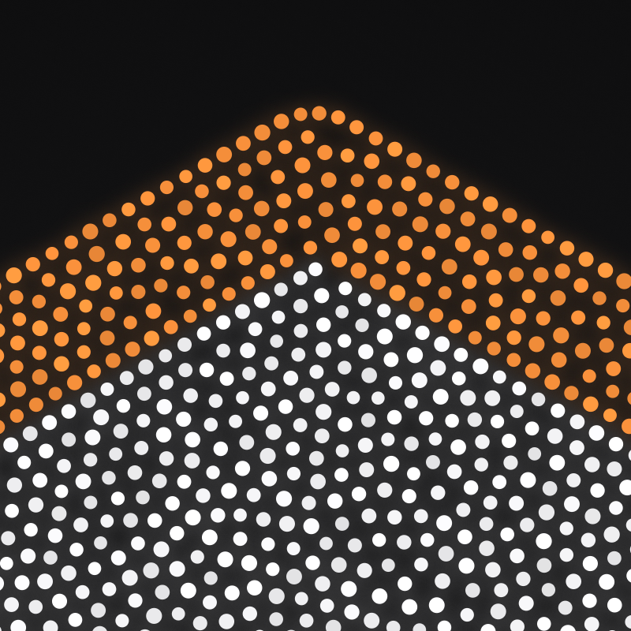
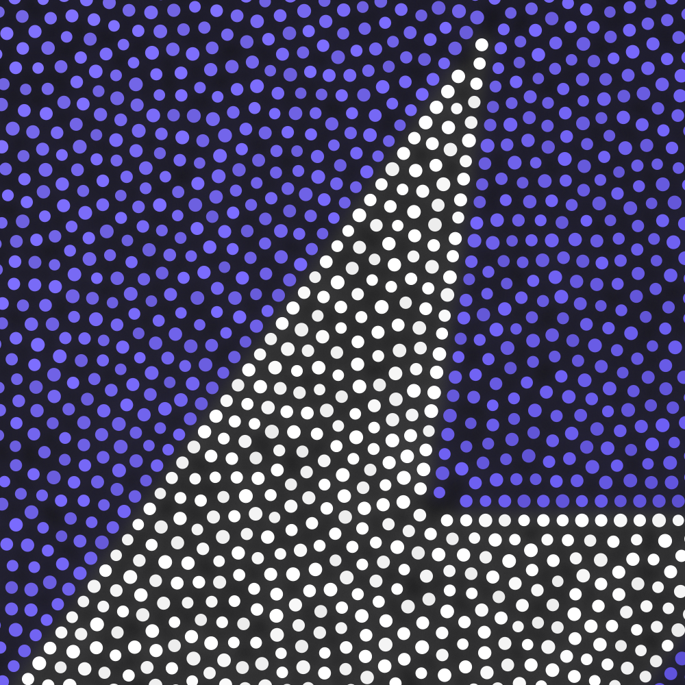
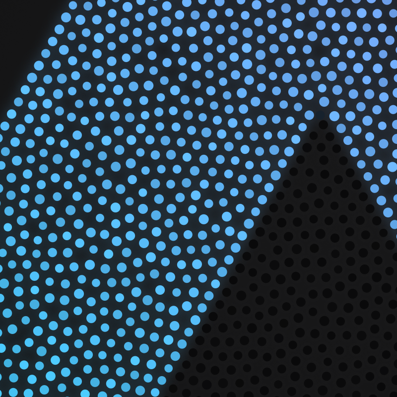
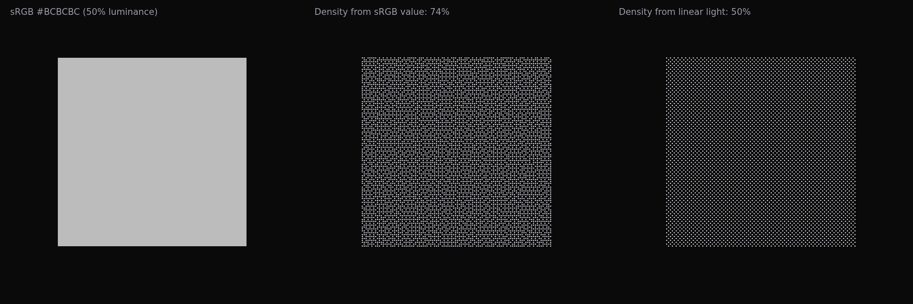

# Making particle logos that survive a real export

Particle logos are easy to demo and hard to ship. The usual recipe samples the logo on a pixel grid at display size: walk the cells, drop a dot wherever the shape is filled. It looks fine in a tweet. Export it at 4K for a keynote slide and every shortcut shows. Edges turn into staircases, the interior is a visible lattice, gradients band, and small counters fill in or vanish depending on where the grid happened to land.

I rebuilt the pipeline behind [Particle Logo](https://particle-logo.vercel.app) (MIT, [source on GitHub](https://github.com/jdcodes1/particle-logo)) so the output holds up at print resolution. This is what changed, in the order the pixels go through it.

*Left: grid sampling. Right: the same mark, traced. Same spacing, same dot size.*

## Edges

Everything starts with a coverage field, not a bitmap. The SVG is rasterised at twice the stage resolution into a per-pixel coverage value from 0 to 1, plus its colour. Before that it is trimmed to its visible content box, so a logo whose viewBox carries padding does not shrink, and fitted into the stage with contain semantics so nothing stretches.

The silhouette is then traced as an iso-contour at coverage 0.5 with marching squares. Vertices are interpolated between pixel centres, so the outline has sub-pixel precision even though the field is a grid.

Corners matter more than anything else on a logo. The tracer measures the turning angle at each vertex over an arc-length window rather than between adjacent vertices, so pixel-level noise does not register. Turns sharper than about 40° survive non-maximum suppression and become pinned points. Each span between two corners is resampled at exactly the particle spacing, so a corner always gets a dot and the dots on either side run evenly up to it.

The outline row is inset along the inward normal by a fraction of the spacing (0.35 by default). A dot whose centre sits on the outline reads as fat; insetting puts the dot's edge on the outline instead. Thin strokes without room for the full inset get 40% of it. Loops shorter than about two spacings, like the dot on an i, collapse to a single particle at their centroid rather than a broken ring.

*A corner from a 4K PNG export of the Hex preset. Each colour region gets its own traced row.*

## The fill

The contour dots seed the interior. From there the fill is a Poisson-disk sample grown outward: pick an active dot, try up to 24 candidates placed exactly on the circle at the minimum distance (Roberts' variant of Bridson's algorithm, which packs tighter and more evenly than the classic annulus), keep the first that fits, retire the dot when nothing fits.

Poisson sampling guarantees no two dots are closer than the spacing. It says nothing about how far apart they can be, and the largest gaps are what the eye picks out as texture. So the interior is relaxed afterwards: fourteen iterations of short-range repulsion (radius 1.45× spacing, quadratic falloff, decaying strength), with contour dots pinned and moves capped at a quarter spacing and rejected if they would leave the shape. A second, slightly tighter fill then plugs any voids the relaxation opened.

I measured what this buys on the Heart preset at the default spacing by sampling the interior on a fine grid and recording each point's distance to its nearest particle, which is the radius of the largest empty circle that fits there.

| | Unrelaxed | Relaxed |
|---|---:|---:|
| Largest empty circle, median | 2.30 | 2.35 |
| Largest empty circle, 99th percentile | 4.13 | 3.83 |
| Largest empty circle, max | 4.98 | 4.83 |
| Nearest-neighbour distance, mean | 5.43 | 5.72 |
| Nearest-neighbour distance, CV | 0.032 | 0.040 |

Units are stage units; the spacing is 5.5. Relaxation does not tighten the nearest-neighbour histogram. Poisson already put a hard floor under it, and spreading dots out to use the room actually widens it a touch. What it does is cut the tail: the worst 1% of gaps shrink by about 7%, and the single largest hole by 3%. That is the difference between a fill that reads as calm and one with visible sparse patches.

## Colour regions

Flat brand marks often have hard colour edges inside the silhouette: a white glyph on a coloured tile, a two-tone ribbon. Those edges deserve the same traced outline as the silhouette. Gradients, on the other hand, must not be cut into bands. Telling the two apart is the job of a small segmenter.

It clusters the opaque pixels' colours with k-means++ (up to eight clusters, dropping any under 0.2% of pixels or within 14 RGB units of another). Then it looks at every pair of adjacent pixels that straddle two clusters. On an anti-aliased hard edge the colour jumps most of the way between the two cluster centres from one pixel to the next; on a gradient it creeps. If fewer than half the boundary pixels between two clusters jump, the clusters merge. What survives are regions separated by genuine hard edges.

Each region gets a soft mask for tracing. Boundary pixels get a fractional weight by projecting their colour onto the line between the two regions' cluster colours, so the traced colour edge lands with sub-pixel precision instead of snapping to the pixel grid. Colour edges get a row of dots on each side, inset half a spacing, so the two rows sit exactly one spacing apart and the edge reads as a clean seam.

*App Icon preset. The bolt is a traced region; the tile behind it is one region with a gradient the segmenter refused to split.*

*Prism preset. A continuous gradient stays continuous.*

## Tone in linear light

Halftone and dither layouts let dot density carry brightness. The obvious way to get a tone value is to read the sRGB channels, and it is wrong: sRGB is perceptually encoded, so a 50%-luminance grey (#BCBCBC) has a channel value of 74%. Compute density from that and mid-grey comes out three-quarters dense. Decode to linear light first and it comes out at 50%, which is what the eye expects when the dots are averaged.

*The same grey square, halftoned from sRGB values (74% density) and from linear light (50%).*

The second half of the trick is colour. When dots keep the source colour, a dark region gets dark dots and sparse dots, and the two dimmings compound. So in the original-colour mode every dot is drawn at the source hue pushed to full value (brightest channel at 1), and density is computed from the value channel. Density times dot colour then averages back to the source colour.

## Everything on the GPU

Every motion that is a pure function of time lives in one vertex shader: the intro (five styles), morphs between layouts, idle drift, twinkle, the periodic sheen sweep, the hover lens and the parallax tilt. Each particle carries a start position, a home position, a delay and four random numbers, and the shader evaluates where it is at time t. The CPU streams one attribute per frame, the spring offsets from the pointer physics.

Dots are analytic discs: the fragment shader computes coverage as `clamp(R - r + 0.5, 0, 1)` for a one-pixel anti-aliased edge. Dots smaller than a pixel keep a one-pixel footprint and fade by the area they would cover, so a fine halftone does not sparkle. Everything is premultiplied alpha, so transparent exports composite correctly.

Morphing between layouts (a different logo, spacing or fill) was the source of the ugliest bugs. Ordering particles along a space-filling curve and pairing them by index produces seams wherever the curve jumps. What works is correspondence by nearest neighbour after normalising both layouts to a common frame: each new particle starts at its nearest old particle. That map is continuous, so regions flow into regions. Old particles nobody picked become ghosts that fly to their nearest new particle and shrink away. When several new particles spring from one old one, only the first keeps its size; the rest emerge small from a little cloud around it, so a split never starts as a bright stacked blob.

The tilt is a real perspective projection, and it is an exact identity when the pointer is away. Exports never see it, so every export is pixel-true to the layout.

## Exports

Every export renders offscreen at a fixed timestep, so the output is identical regardless of display size or refresh rate. PNG goes up to 8K, after checking the GPU's maximum render size. SVG writes one real circle per particle, so it stays editable. Video is encoded in the browser with WebCodecs through mediabunny: H.264 MP4 where the browser can, VP9 WebM with an alpha channel for transparent clips. A looping clip is the intro, a hold, then the intro played backwards, so the last frame equals the first and the loop is seamless.

The embed is a single HTML file with no dependencies, about 100 KB for a typical logo. Positions are quantised to 16 bits and base64-encoded, the spring physics is the same code the app runs (serialised with `toString()`), and the intro plays when the logo scrolls into view.

## Try it

[particle-logo.vercel.app](https://particle-logo.vercel.app). Paste an SVG, pick a look, export. It is MIT licensed and [the source is on GitHub](https://github.com/jdcodes1/particle-logo). If you have a logo that breaks it, reply with the SVG and I will post the 4K.
